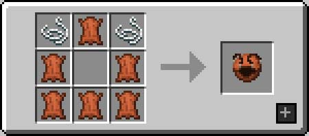
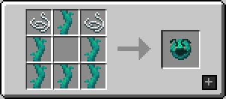
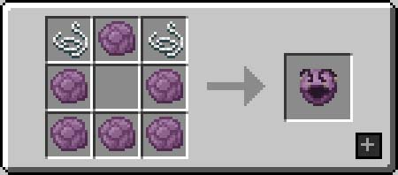

# Rat's Mischief

**Rat's Mischief** (also known as "Rat's Rats" or just "Mischief") is a Minecraft mod introducing a new mob, the rat, as well as mechanics revolving around these new possible pets.

# Wiki

## Rats

Rats can be found in previously inhabited villages that are now abandoned. Once a natural village no longer has tenants, rats will start spawning if a player is near that empty village and that village still had beds.

### Behaviours

Rats will behave in a very similar manner to wolves, attacking what the player targets or what harms the player. They deal one point of damage but ignore invulnerability ticks, making a mischief stronger the bigger it becomes.

Rats will pick up any item stack on the floor they come across, and bring it back to their owner if they are tamed. If they are hurt and the item is edible, they will consume it and restore an amount of health equivalent to the amount of saturation the food gives as well as apply any effects the food provides. No matter their state, if rats come across a drinkable potion, they will consume it and get its effects.

#### Types

There exists multiple type of rats, with currently:

- 8 natural variants: Albine, Black, Grey, Husky, Chocolate, Light Brown, Russian Blue and Gold with a 1/150 chance to spawn.
- 6 named variants: Remy (has to be Russian Blue), doctor4t, Ratater, Jorato, Jerma and finally Rat Kid, that can sport different colors and clothes (depending on how the player dyes them) and smug dance instead of sniffing.

## Staves

When appearing naturally in an empty village, rats may spawn with staves in their possession. These staves can be obtained by taming the rats possessing them and are useful to make the rats perform specific tasks. Each staff use orders the rats to execute the corresponding order for 15 seconds.

- **Harvest Staff:** Harvest any mature crop and replant any cultivatable item on farmland tiles.
- **Collection Staff:** Use with a block in the other hand to make rats break the corresponding blocks they come across. Rats can break blocks with a hardness of 1 plus 1 per level of strength that is applied to them.
- **Love Staff:** Use near animals to order rats to breed them. Rats need the correct item to breed the animals. Rats can breed other rats this way.

## Rat Pouches

Rat pouches can be used to quickly gather rats back. Using a pouch on a rat will put that rat inside the pouch. Shift-using an empty rat pouch will gather all rats that the pouch can hold in the vicinity. Shift-using a filled rat pouch releases all rats inside it.

Pouches can be crafted like bundles with leather, twisted vines and popped chorus fruit, to produce respectively pouches with a capacity of 5, 10 and 20 rats.

# FAQ

#### Can I include this mod in a modpack?

**Yes**: You can. Go ahead, don't bother asking. Please however provide credit and a link to both the GitHub repository and Curse Forge project page.

#### Will you be making a Forge version? Does a Forge version exist?

**No:** I will not be making a Forge version of this mod. The code being GPL3 however, feel free to do a port if you feel like it.

## [**If you have questions, propositions or ideas, join us on Discord!**](https://ladysnake.glitch.me)

[****](https://ladysnake.glitch.me)